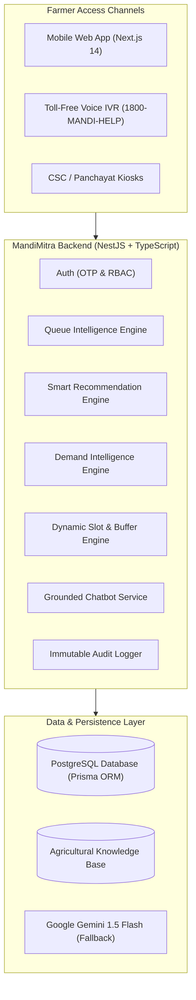

# MANDIMITRA (मंडीमित्र)
### Smart Procurement Scheduling, Queue Management & Farmer Assistance Platform
**Smart India Hackathon 2026 Project**

---

## 📌 Executive Summary
**MandiMitra** is a digital platform designed to eliminate farmer waiting time at agricultural procurement and mandi centres. 

> **Core Design Principle:**  
> *"Don't make farmers wait at the mandi. Let the system predict, schedule and guide them."*

In traditional mandis, farmers travel long distances and wait 6 to 10 hours in congested lines with tractor-trolleys without knowing current queue lengths, token availability, or yard bottlenecks. MandiMitra replaces physical waiting with **predictive appointment scheduling**, **real-time queue tracking**, **No-Wait Departure Guidance**, a **Mandi Yard Digital Twin**, and a **grounded multilingual voice & chat assistant**.

---

## 🚀 Key Differentiators & Features

| Feature | Description |
|---|---|
| **1. Smart Centre Recommendation** | Multi-factor weighted score optimizing distance, queue density, processing speed, and yard headroom with full explainability ("Why was this recommended?"). |
| **2. Dynamic Slot Scheduling** | 30-minute arrival slots with anti-overbooking buffers, transaction safety, and automated sequence numbering. |
| **3. No-Wait Departure Alerts** | Real-time prediction telling farmers: *"You don't need to leave yet. Recommended departure: 11:15 AM."* Based on queue speed, transit time, and safety buffer. |
| **4. Live Queue & Operator Console** | Real-time FIFO token progression showing *Now Serving*, *Next*, and counter actions (Call, Check-in, Start, Complete, Skip). |
| **5. Mandi Yard Digital Twin** | Visual operational digital twin representing entry gates, waiting sheds, electronic weighbridges, and throughput gauges. |
| **6. Deterministic Demand Engine** | Temporal demand analysis across 15-min, 30-min, 60-min, slot, morning, and afternoon horizons to trigger counter redistribution. |
| **7. Grounded Multilingual Chatbot** | Trilingual AI Assistant (English, Hindi, Marathi) with strict 5-tier priority: Database > Business Logic > Knowledge Base > Gemini fallback. |
| **8. Non-Smartphone Voice IVR Helpline** | Interactive toll-free simulator (1800-MANDI-HELP) with DTMF keypad inputs and instant SMS confirmation. |
| **9. CSC / Panchayat Assisted Kiosk** | Inclusive interface for Village Level Entrepreneurs (VLEs) to assist digitally illiterate farmers with tracked operator audit logs. |
| **10. Transparent DBT Tracker** | Direct Benefit Transfer tracker displaying MSP procurement values, quality assaying results, and Aadhaar bank disbursements. |

---

## 🏗️ System Architecture



---

## 🛠️ Technology Stack

- **Frontend**: Next.js 14 (App Router), React 18, TypeScript, Tailwind CSS, Lucide Icons, Recharts
- **Backend**: NestJS, TypeScript, REST APIs, Swagger / OpenAPI
- **Database & ORM**: PostgreSQL 16, Prisma ORM (20+ normalized models)
- **AI & Chatbot**: Multilingual Engine (English, हिन्दी, मराठी), Rule-based Classifier + Grounded Database Priority + Google Gemini
- **Telephony & IVR**: Web Audio API DTMF generator, Speech Synthesis API, Webhook simulator
- **Testing**: Jest, Supertest, Ts-Jest (100% pass on critical business logic)

---

## 🗄️ Database Models

- `User`: Roles (`FARMER`, `ADMIN`, `OPERATOR`, `CSC_OPERATOR`)
- `Farmer`: Farmer ID (`MH-NAS-2026-XXXX`), Aadhaar-linked mobile, village, taluka, crop preferences
- `Centre`: Lat/Lng coordinates, capacity, active counters, processing speed, operating hours
- `CentreOperator`: Assigned centre, counter number, active status
- `Slot`: Date, time window (`MORNING`, `AFTERNOON`, `EVENING`), max capacity, buffer capacity
- `Booking`: Booking number, crop, quantity, status, assisted metadata
- `QueueToken`: Token number (`B-042`), queue position, arrival guidance, departure time
- `QueueEvent`: State transitions (`TOKEN_ISSUED`, `CHECKED_IN`, `CALLED`, `PROCESSING`, `COMPLETED`)
- `Procurement`: Moisture content, grade, MSP rate per quintal, total value
- `Payment`: Direct Benefit Transfer (DBT), transaction ref, bank last-4
- `DemandMetric`: Temporal window metrics, queue pressure index, capacity utilization
- `Alert`: Operational bottleneck alerts, redirection suggestions
- `AuditLog`: Cryptographic audit trail of all queue and admin actions

---

## 📖 Walkthrough & Hackathon Demo Story (Section 47)

### Step 1: Open MandiMitra
A farmer named **Ramesh Kumar** (`MH-NAS-2026-0812`, Pimpalgaon) opens MandiMitra. The app greets him in Hindi/Marathi/English:  
*"Good Morning, Ramesh."*

### Step 2: Smart Recommendation
There are 4 centres nearby:
- **Centre A (Lasalgaon)**: 2.4 km away • 45 min wait • 85% capacity
- **Centre B (Niphad Grain Hub)**: 4.1 km away • 18 min wait • 62% capacity • 4 active counters
- **Centre D (Sinnar)**: Overloaded (98% capacity)

MandiMitra recommends **Centre B** with clear reasons:
- *4.1 km away*
- *Only 6 farmers waiting in line*
- *Fast turnaround: ~18 min wait*
- *38% open yard headroom*
- *Slot available at 12:30 PM*

### Step 3: Dynamic Booking & Token Generation
Ramesh selects the **12:30 PM slot** for 85 quintals of Wheat.  
The system allocates **Token B-042**.

### Step 4: No-Wait Smart Arrival Guidance
Instead of rushing to the mandi, the app advises:  
*"You don't need to leave yet. Your estimated turn is 11:42 AM. Recommended departure from home: 11:15 AM (25m transit + 15m buffer)."*

### Step 5: Live Calling & Processing
As the queue advances at Centre B:
1. Operator calls **B-035** (Processing)
2. Operator calls **B-036** (Called)
3. Ramesh sees *"3 farmers ahead — please start travelling"*
4. Ramesh arrives, scans digital pass, and is checked in
5. Counter #1 weighs produce (85 qtl Wheat @ ₹2,275 MSP = ₹1,93,375)
6. Status changes to **COMPLETED** and DBT payment is queued to Aadhaar-linked account!

---

## ⚙️ Running Locally

### 1. Prerequisites
- Node.js v18+ (tested on Node v24)
- PostgreSQL 14+ running locally (e.g. `localhost:5432`)

### 2. Clone & Install Dependencies
```bash
git clone <repo-url>
cd MandiMitra

# Install dependencies
npm install
npm install --prefix backend
npm install --prefix frontend
```

### 3. Database Setup & Seeding
```bash
# Push schema to PostgreSQL database
npm run prisma:generate
npm run prisma:migrate # or npm run prisma:db:push --prefix backend

# Seed realistic demo data (Centres, Ramesh, Active Queue, MSP rates)
npm run prisma:seed
```

### 4. Start Development Servers
```bash
# In Terminal 1 (Backend on http://localhost:4000)
npm run dev:backend

# In Terminal 2 (Frontend on http://localhost:3000)
npm run dev:frontend

# Or concurrently:
npm run dev
```

### 5. Access Endpoints
- **Frontend App**: [http://localhost:3000](http://localhost:3000)
- **Backend API**: [http://localhost:4000/api](http://localhost:4000/api)
- **Swagger Documentation**: [http://localhost:4000/api/docs](http://localhost:4000/api/docs)
- **Voice IVR Phone Simulator**: [http://localhost:3000/ivr-simulator](http://localhost:3000/ivr-simulator)

---

## 🧪 Automated Testing

Run the test suite:
```bash
cd backend && npm test
```

### Test Coverage Includes:
- `queue.service.spec.ts`: Estimated wait formulas, departure alerts (`DO_NOT_LEAVE_YET` vs `START_TRAVEL`), operator token calling.
- `recommendation.service.spec.ts`: Multi-factor optimization, overload penalties, explainability generation.
- `demand.service.spec.ts`: Queue pressure index, bottleneck detection across 6 temporal windows.
- `chatbot.service.spec.ts`: Trilingual language detection, live database priority routing, verified knowledge base responses.

---

## 🔒 Security & Fair Allocation
- **Role-Based Access Control (RBAC)**: Distinct permissions for `FARMER`, `OPERATOR`, `ADMIN`, `CSC_OPERATOR`.
- **Anti-Overbooking Transactions**: Prisma ACID transactions prevent race conditions during slot allocation.
- **Audit Logs**: Cryptographic timestamping of all counter calls, cancellations, and capacity overrides.
- **Privacy First**: Sensitive banking details masked to last 4 digits; zero unnecessary PII exposed.

---

## 🏆 Smart India Hackathon Alignment
MandiMitra provides a demo-ready, production-architected solution directly addressing farmer distress, fuel wastage, and physical overcrowding at agricultural procurement yards across India.
